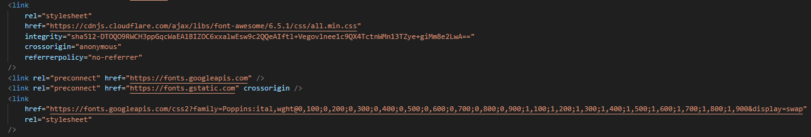
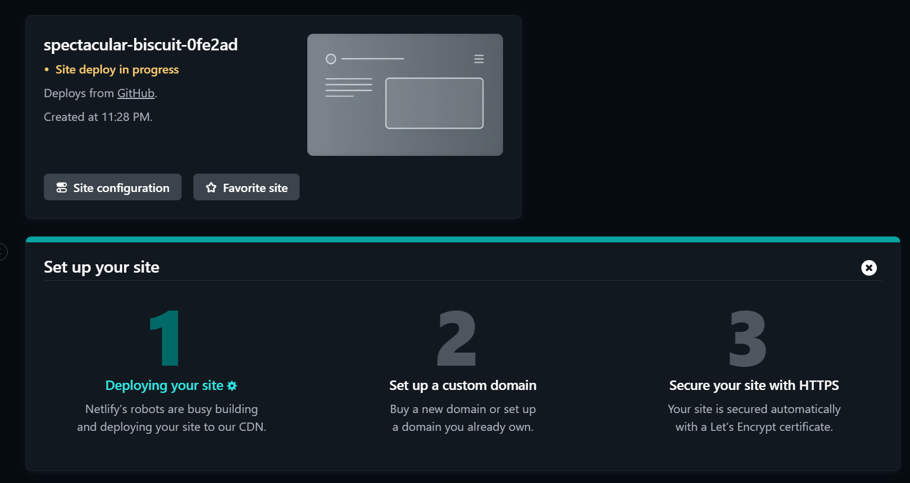
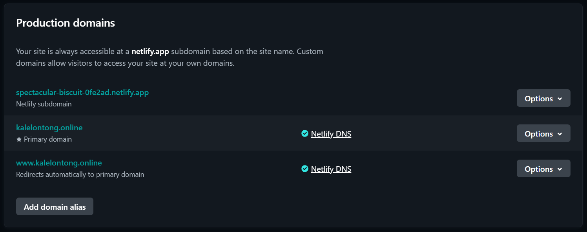
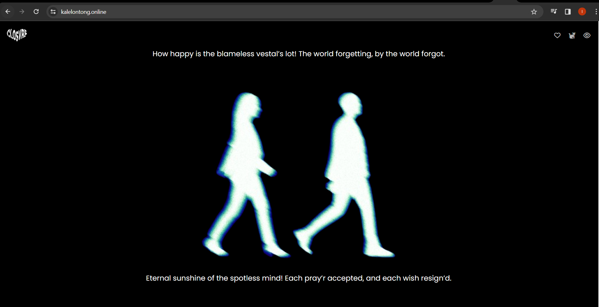

# CLOSVRE CLOTHING BRAND WEBSITE

This website is a website that I intended for a clothing brand that I want to run someday. With this website, I hope that there will be many benefits obtained and can launch my business that I will later run.

[Closvre Website](www.kalelontong.online)

# Documentation

First, I create a web design with HTML and CSS, there are several CSS External Libraries that I use that are allowed such as Google Fonts, and fontawesome.

After I finished the design and connected my code to github, I deployed the repository to netlify.

after that I added a domain to the site that was deployed on netlify.

Congratulations, your website has entered the domain with the name you want.

